

## 更新日志
* version 1.4.0  2020-01-22  增加一部分系统忽略。
* version 1.3.0  2020-01-21  修复命名冲突导致的重复混淆，增加一部分系统API忽略。
* version 1.2.0  2020-01-21  修复一些常见问题。
* version 1.1.0  2020-01-15  工具限时免费使用开放。欢迎咨询。
* version 1.1.0  2020-01-11  优化属性匹配，增加删除无用文件功能。
* version 1.0.0  2020-01-04  正式版本发布，目前只支持OC项目混淆。

## 链接导航
* [工具介绍](https://blog.csdn.net/YYConfuse/article/details/112172711)
* [工具使用教程](https://blog.csdn.net/YYConfuse/article/details/112172806)
* [使用问答](http://note.youdao.com/s/1kvOul99)

## 联系作者
* QQ          209658738

* 微信        YYConfuse

## 权限获取
新用户免费使用30天，期间上架成功，再送30天。权限联系作者获取。

# 摘要
iOS混淆 iOS代码混淆 iOS过审工具 iOS上架 iOS代码混淆工具 iOS工具 iOS马甲包 iOS马甲包工具 iOS混淆 iOS过4.3 iOS过审 iOS confuse iOS code confuse iOS2.3.1解决 iOS账号调查解决办法 iOS账号调查解决 iOS账号调查过审 OC代码混淆 IOS源码混淆 OC混淆 OC代码混淆 OC过审工具 OC代码混淆工具 OC工具 OC马甲包 OC马甲包工具 OC混淆 OC过4.3 OC过审 OC confuse OC code confuse OC解决  OC代码混淆 IOS源码混淆 Flutter源码混淆 Flutter混淆  Flutter代码混淆  Flutter confuse  Flutter马甲包工具  Flutter过审工具 Flutterg提审 Flutter审核 RN源码混淆 RN混淆  RN代码混淆  RN confuse  RN马甲包工具  RN过审工具 RN提审 RN审核  React Native 混淆

# 前言
我们长期给用户提供上架技术支持,上架解决方案。
此工具主旨为解决代码加固，以及审核4.3，other，2.3.1等原因导致的拒审。
处理到位，基本100%过审核！！！

本工具使用简单，全可视界面，没门槛，刚入门小白也能很轻松的使用。
根据2021年1月份的统计数据来看，可以达到95%过包率。实测一套代码一周提15个，完全过审13个，剩下两个也过了机审。

# 工具介绍

## 专注iOS代码混淆,加密加固的辅助工具
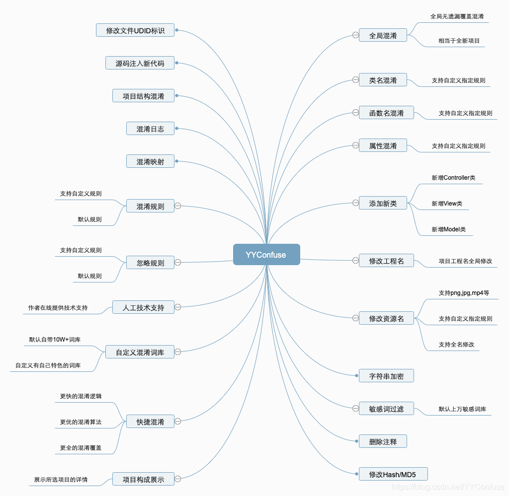

YYConfuse是一款专业的，辅助iOS开发者对源码进行混淆，加固，加密的工具。
支持语言广泛，目前已经支持OC，Swift，Flutter，RN等主流开发语言。
后期更支持游戏项目，您值得拥有。

本工具支持函数方法修改，类名修改，属性名修改，工程名修改，资源名修改，文件UDID标识修改，项目结构修改，字符串加密，敏感词过滤，添加垃圾代码，重新定义函数执行序列，删除注释，修改文件Hash/MD5等功能，

## 工具界面

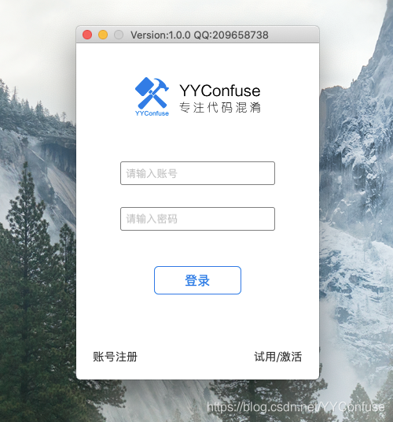
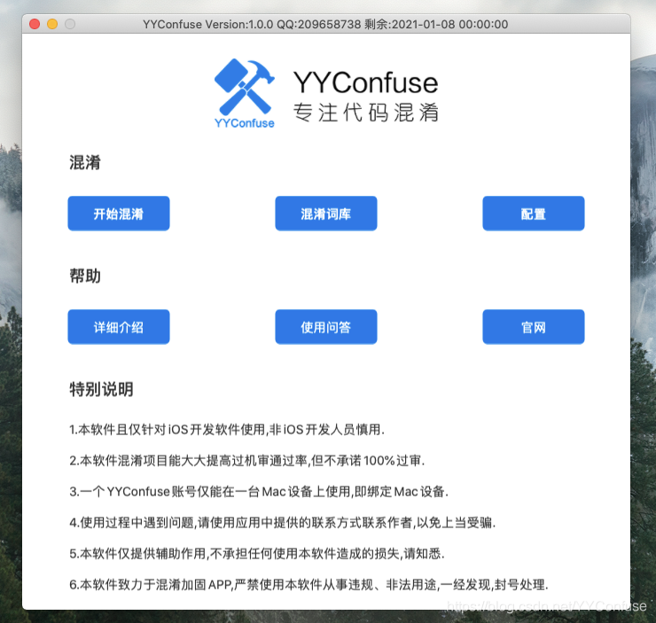
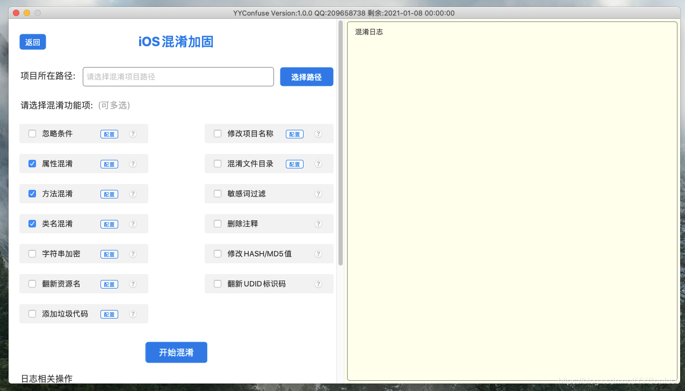

## 工具功能介绍

 1. **修改项目名称**

混淆前项目名称Test_1019，混淆后改为Demo111

 2. **属性混淆**
混淆前后，属性名称已经完全改变
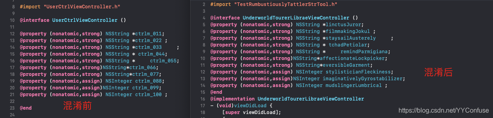
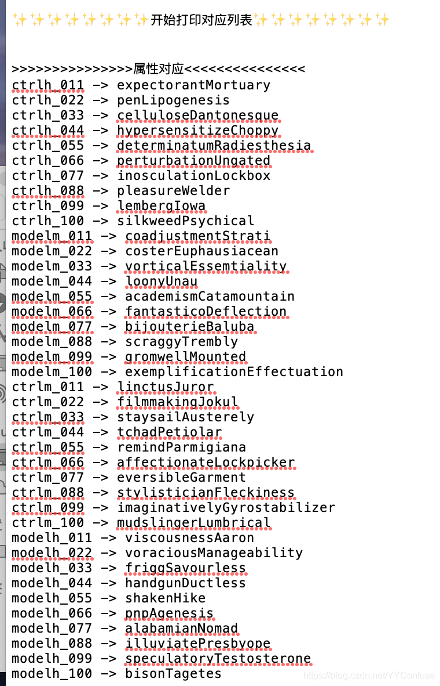

 3. **文件目录混淆**
混淆前后项目目录结构改变
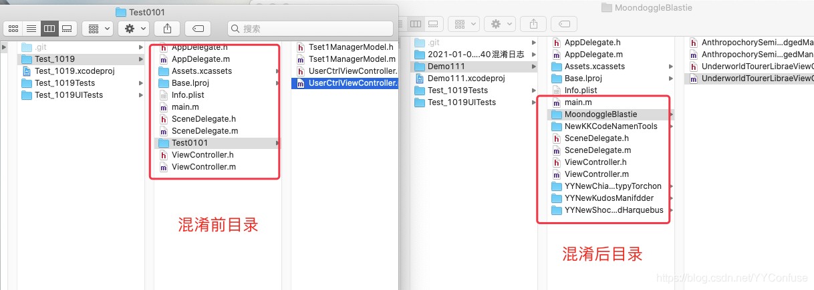

 4. **方法混淆**
混淆后方法名称和数量都发生改变
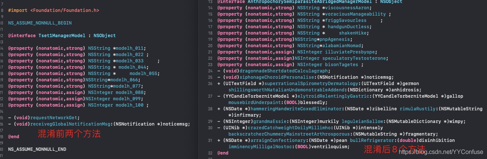

 7. **敏感词过滤**
一些敏感词的出现，会导致项目的拒审，例如："支付宝"，"富二代"等，还有一些涉及人身攻击，不和谐的词汇，都会导致一些莫名其妙的原因拒审。
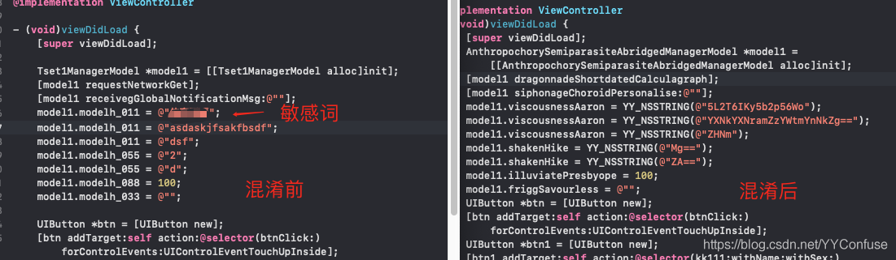

 8. **类名混淆**
混淆后类名完全改变

 9. **删除注释**
注释只是帮助开发者开发，对于打包上架是没有帮助的，这个是可以删掉的，删除后，项目中将没有一句任何形势的注释 
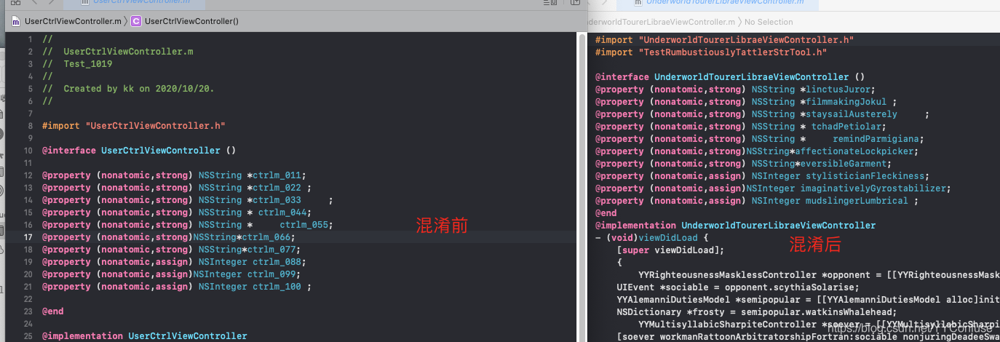
 
 11. **字符串加密**
字符串将会进行加密处理，防止二进制文件的字符串对比识别
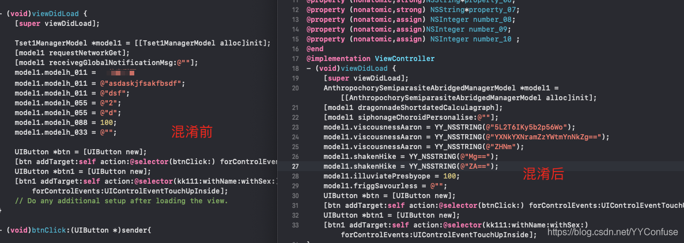

 12. **修改HASD/MD5值**
混淆后，所有资源文件的MD5将会发生改变
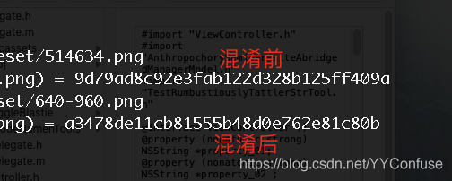

10. **翻新资源名**
资源名翻新，无遗漏

11. **翻新UDID标识**
就像每个人都有自己的身份证号码一样，对于项目中的每个文件来说，每个文件都有属于自己的唯一编码，这个编码是开发工具赋予文件的索引编码，一旦生成，文件中的代码全部删除重构都不会使其发生改变。

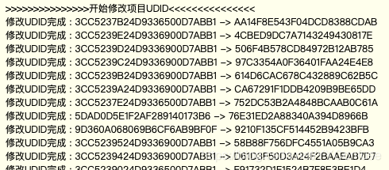

13. **添加垃圾代码**
 新增人工模拟的功能代码文件，且在源码中插入新增代码，达到增加二进制文件差异化，改变函数执行序列的效果。
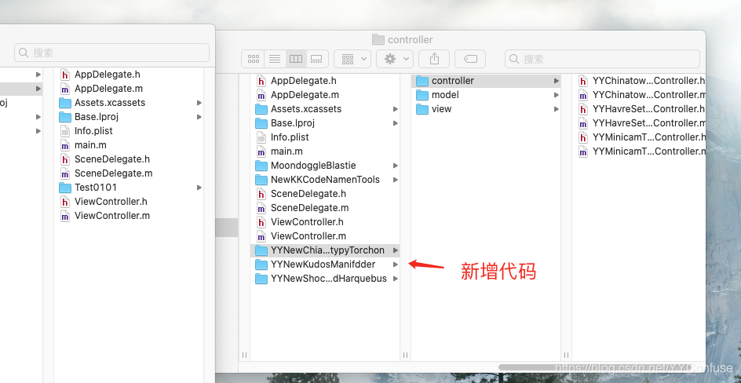

# 说明
本工具会根据时时审核政策情况，进行针对性调整更新，以保证其效果。另外，有任何问题和建议，可以通过软件内的联系方式联系作者。

