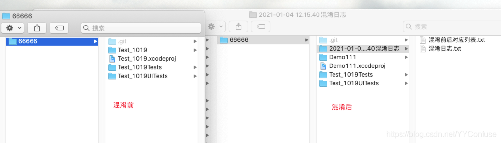
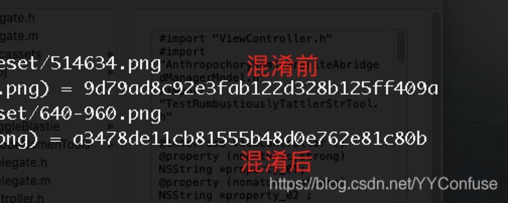
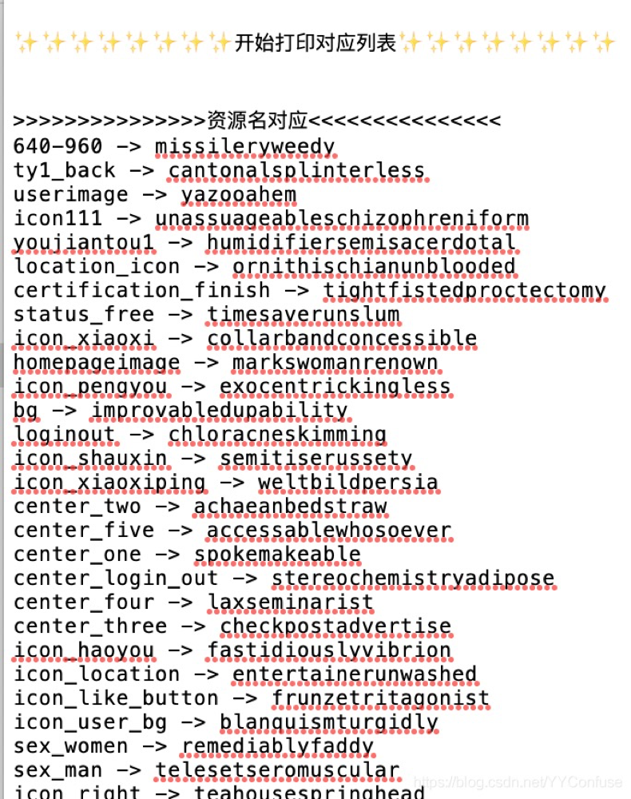
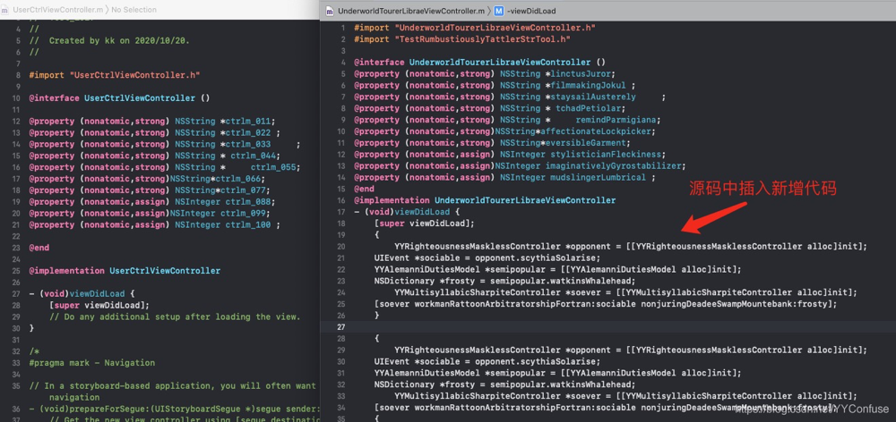

## 更新日志
* version 1.0.0  2020-01-04  正式版本发布，目前只支持OC项目混淆

## 链接导航
* [工具介绍](https://blog.csdn.net/YYConfuse/article/details/112172711)
* [工具使用教程](https://blog.csdn.net/YYConfuse/article/details/112172806)

# 摘要
iOS混淆 iOS代码混淆 iOS过审工具 iOS上架 iOS代码混淆工具 iOS工具 iOS马甲包 iOS马甲包工具 iOS混淆 iOS过4.3 iOS过审 iOS confuse iOS code confuse iOS2.3.1解决 iOS账号调查解决办法 iOS账号调查解决 iOS账号调查过审 OC代码混淆 IOS源码混淆 OC混淆 OC代码混淆 OC过审工具 OC代码混淆工具 OC工具 OC马甲包 OC马甲包工具 OC混淆 OC过4.3 OC过审 OC confuse OC code confuse OC解决  OC代码混淆 IOS源码混淆 Flutter源码混淆 Flutter混淆  Flutter代码混淆  Flutter confuse  Flutter马甲包工具  Flutter过审工具 Flutterg提审 Flutter审核 RN源码混淆 RN混淆  RN代码混淆  RN confuse  RN马甲包工具  RN过审工具 RN提审 RN审核  React Native 混淆

# 前言
我们长期给用户提供上架技术支持,上架解决方案。有感于目前苹果加大了审核力度,导致诸多开发者苦不堪言。由此,我们开放了此工具,以帮助诸多开发者解决上架过程中遇到的各种问题。

# 工具介绍
1. 项目名修改
2. 项目目录结构差异化调整
3. 类名，文件名修改，类文件hash值修改
4. 图片，bundle，xib等资源文件文件名，hash值修改
5. 新增全新代码文件，新增类文件相互调用引用
6. 在原源码中，添加对新增代码的引用调用
7. 在原源码中，新增新的函数方法实现
8. 用户自定义混淆词库
9. 词库敏感词过滤功能
    
# 图文介绍
* 项目名修改  项目目录结构改变 

* 资源  文件 MD5修改

* 资源名  文件名修改

* 源码中插入混淆代码  新建全新混淆代码

# 使用前必看
1. 本工具支持MACOS 10.10及以上系统版本
2. 本工具主要辅助解决代码导致的4.3，2.1，2.3.1，账号调查等问题，并且长期维护更新
3. 本工具为上架辅助工具，不能保证一定过审，只是大概率提高过机审概率，使用前请悉知
4. 混淆前请务必备份源码
5. 工具支持语言视需求进行扩展开发,更多语言支持正在开发中,敬请期待

## 无法打开或者打开就闪退
如果打开提示->XXX.app 已损坏,打不开。您应该将它移到废纸篓 ” 或 “ 打不开 XXX.app,因为它来自身份不明的开发者
1. 打开终端（Terminal.app）
2. 拷贝粘贴 sudo spctl --master-disable,按回车键
3. 输入你的账户密码,按回车键确认执行（该密码不会显示,直接输入即可）

## 如已经开启任何来源,但依旧打不开（macOS Catalina 10.15以上会遇到）
1. 在系统的“安全与隐私”中允许“任何来源”,再打开终端
2. 输入以下命令,回车(注意路径根据自己的实际情况替换)
sudo xattr -d com.apple.quarantine /Applications/YYConfuse.app
1. 重启App即可.

